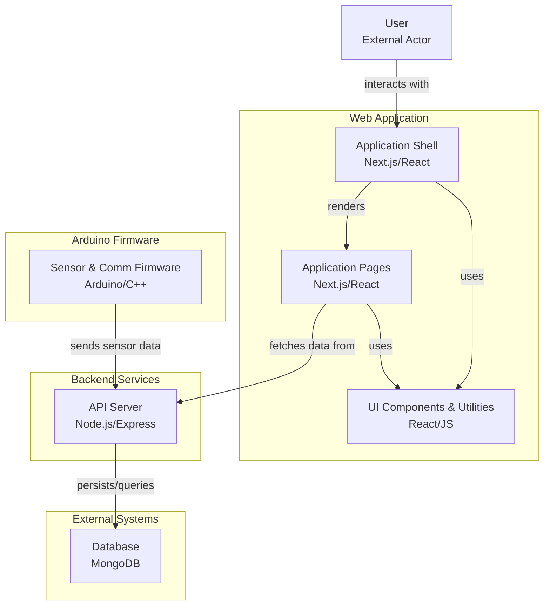
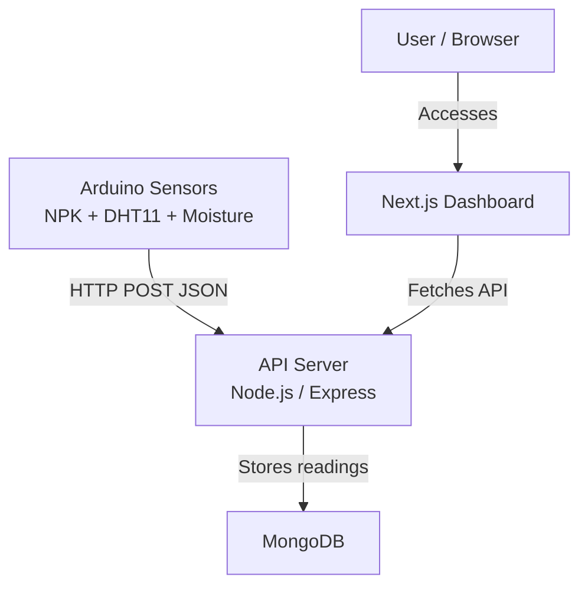
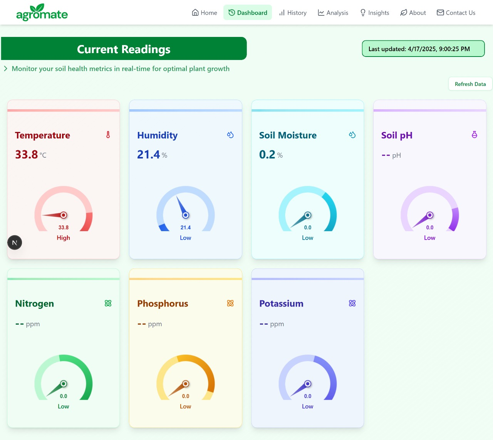
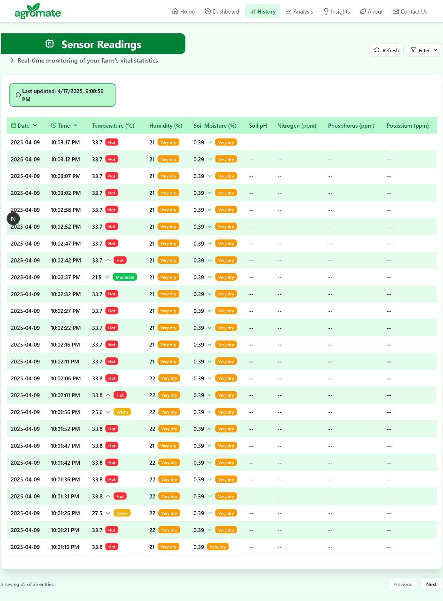

# SMARTs IOT System + AgroMate Web App

This is the **web dashboard** and backend API server for **AgroMate** — a smart soil health monitoring system. Built with **Next.js**, it displays real-time and historical data from soil sensors (NPK, DHT11, Soil Moisture) stored in **MongoDB**.


##  System Architecture 



##  Folder Structure

```
arduino/
├── docs/
│   ├── arduino_microcontroller.md     # Info about Arduino Uno/Nano setup
│   ├── dht11_sensor.md                # DHT11 wiring and usage
│   ├── esp32_microcontroller.md       # ESP32 setup guide
│   └── soil_moisture.md               # Capacitive soil moisture guide
├── sketches/
│   ├── SensorReader.ino               # Reads NPK + DHT11 + Soil Moisture
│   └── WifiModule.ino                 # Sends data to server via Wi-Fi
└── README.md                          # This file

web-app/
├── app/                   # App routing and layout (Next.js app directory)
├── components/            # React UI components (charts, cards, etc.)
├── functions/             # Data processing utilities
├── hooks/                 # Custom React hooks
├── lib/                   # API clients, DB setup, etc.
├── public/                # Static assets (images, icons)
├── server/                # Backend API routes & DB logic
│   ├── models/            # MongoDB models (e.g., NPKReading.js)
│   ├── routes/            # Express-style route handlers
│   └── server.js          # API server entry (if custom)
├── styles/                # (optional) Global CSS
├── README.md              # This file
├── .gitignore
├── next.config.mjs        # Next.js configuration
├── eslint.config.mjs      # ESLint setup
├── package.json
└── postcss.config.mjs     # Tailwind/PostCSS config
```


##  Getting Started

### 1. Clone & Install

```bash
git clone https://github.com/your-username/agromate.git
cd web-app
npm install
```

### 2. Configure Environment

Create a `.env.local` file:

```
MONGO_URI=mongodb://localhost:27017/agromate
NEXT_PUBLIC_API_BASE=http://localhost:3000
```

### 3. Run the Dev Server

```bash
npm run dev
```


##  Features

*  **Dashboard View**: Real-time NPK + Temp/Humidity + Soil Moisture
*  **Historical Charts**: Line/Bar graphs using Chart.js or Recharts
*  **API Integration**: REST endpoints under `/api`
*  **Data Sync**: Push data from ESP32 or Arduino using HTTP POST


## 📬 API Example (POST)

```http
POST /api/esp32/addData
Content-Type: application/json
{
  "nitrogen": 45,
  "phosphorus": 30,
  "potassium": 50,
  "temperature": 26.5,
  "humidity": 43,
  "moisture": 382
}
```


##  Live Dashboard Preview

 with a **Next.js web dashboard** that visualizes real-time and historical data stored in **MongoDB**.


## ⚙️ Tech Stack Overview

| Technology                                                                                                                     | Description        | Role in Project                                          |
| ------------------------------------------------------------------------------------------------------------------------------ | ------------------ | -------------------------------------------------------- |
|                          | React framework    | Builds server-side rendered (SSR) & static web dashboard |
|                 | JS library         | Builds dynamic client-side UI components                 |
|                       | JavaScript runtime | Runs the Express-style backend APIs inside Next.js       |
|     | Web framework      | Handles HTTP requests from sensors and dashboard         |
|               | NoSQL database     | Stores sensor readings (NPK, DHT11, Moisture)            |
|  | CSS framework      | Styles dashboard responsively                            |
|                  | Code hosting       | Hosts repository for collaboration & CI/CD               |
|                     | Design tool        | UI mockups & wireframes                                  |


## 🏗️ System Architecture

### Architecture Overview




### Modules & Flow

| Module                | Description                                                       |
| --------------------- | ----------------------------------------------------------------- |
| Arduino Firmware      | Reads sensors, sends JSON via Wi-Fi (ESP32)                       |
| API Server (Express)  | Receives sensor data, stores to MongoDB, serves data to dashboard |
| MongoDB               | Persists NPK, temp/humidity, moisture history                     |
| Next.js Web Dashboard | Displays real-time + historical charts to farmers                 |


##  Project Structure

```
arduino/
├── docs/                  # Guides for wiring & config
├── sketches/              # .ino files for reading & sending data

web-app/
├── app/                   # Next.js routing, layouts
├── components/            # Reusable React UI (charts, cards)
├── functions/             # Data utilities
├── hooks/                 # Custom React hooks
├── lib/                   # DB & API helpers
├── server/                # Models, API route handlers
│   ├── models/            # Mongoose schemas
│   └── routes/            # Express-style routes
├── public/                # Static assets
├── styles/                # Tailwind / global CSS
├── package.json
└── next.config.mjs
```


## 🚀 Getting Started

### ⚡ Installation

```bash
git clone https://github.com/your-username/agromate.git
cd web-app
npm install
```

###  Configuration

Create `.env.local`:

```bash
MONGO_URI=mongodb://localhost:27017/agromate
NEXT_PUBLIC_API_BASE=http://localhost:3000
```


###  Running Dev Server

```bash
npm run dev
```

Visit: [http://localhost:3000](http://localhost:3000)

---

##  Features

| Feature                | Description                                          |
| ---------------------- | ---------------------------------------------------- |
| 📊 Real-time Dashboard | Displays live NPK, Temp, Humidity, Moisture data     |
| 📈 Historical Charts   | Shows past trends with line/bar charts (Chart.js)    |
| 🛰️ REST API           | Sensors POST JSON data, dashboard fetches with GET   |
| 🛠️ Modular UI         | Reusable card & chart components under `/components` |
| 🗃️ MongoDB Storage    | Archives all sensor readings for historical analysis |


##  Example API Usage

###  POST New Data (from ESP32)

```http
POST /api/esp32/addData
Content-Type: application/json
{
  "nitrogen": 45,
  "phosphorus": 30,
  "potassium": 50,
  "temperature": 26.5,
  "humidity": 43,
  "moisture": 382
}
```

## 📊 Live Dashboard Screenshots

| Home                                        | Dashboard                                      | History                                    |
| ------------------------------------------- | ---------------------------------------------- | ------------------------------------------ |
|  |  |  |


## 🚀 Build & Deploy

```bash
npm run build
npm start
```


##  Developer Notes

* **API + Web are monolithic:** Next.js serves both UI & API.
* **MongoDB models isolated:** Located in `/server/models/`.
* **Easy to extend:** Plug new sensors, add fields to MongoDB schema, and display in charts.


##  Resources

* 📖 [Next.js Documentation](https://nextjs.org/docs)
* 📖 [MongoDB Docs](https://www.mongodb.com/docs/)
* 📖 [Chart.js](https://www.chartjs.org/docs/latest/)
* 📖 [Arduino + ESP32 WiFi](https://randomnerdtutorials.com/esp32-http-post-esp8266/)

